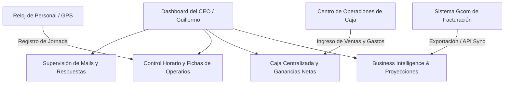

# Centro de Operaciones y Control Estratégico - Dashboard del CEO

Este documento detalla la arquitectura, el funcionamiento técnico actual y la hoja de ruta estratégica para la transformación del **Dashboard del CEO (Guillermo)** en la base de control y centro operativo digital absoluto de **Alvarez Placas**.

---

## 1. Arquitectura y Funcionamiento Actual del Panel del CEO

El panel del CEO se encuentra accesible para `guillermo@alvarezplacas.com.ar` en la ruta `/ceo` del sistema administrativo. Su diseño visual sigue la estética premium de alto contraste **Dark Mode (Adobe Photoshop/Premiere CC Style)** con tipografías legibles (`Inter` y `Roboto Mono`), micro-animaciones fluidas y estados activos.

Actualmente, el núcleo funcional es la **Supervisión y Control de Canales de Correo Electrónico**, implementado para solucionar la pérdida recurrente de oportunidades comerciales e información clave por parte de los operarios.

### ⚙️ Mecanismo de Sincronización y Autenticación de Emails
El backend del correo está diseñado quirúrgicamente bajo los siguientes lineamientos:
*   **Autenticación Dovecot (Master User):** Se utiliza una cuenta maestra de administración IMAP de `alvarezplacas.com.ar` para conectarse a las bandejas del personal comercial (`maru@alvarezplacas.com.ar`, `javier@alvarezplacas.com.ar`) sin necesidad de conocer sus contraseñas individuales o pedir constantes inicios de sesión.
*   **Filtro Inteligente Anti-Spam en Tiempo Real:** El endpoint `/api/ceo/mails.ts` analiza de manera heurística los correos entrantes basándose en remitentes conocidos, palabras clave y flags de cabecera. Clasifica el correo marcándolo con un tag de `spam` o `normal`, aislando el correo irrelevante del flujo diario principal.
*   **Visualización Completa (Mail Detail):** Mediante `/api/ceo/mail-detail.ts`, el sistema realiza una llamada precisa por `UID` (Unique Identifier) al servidor IMAP local, extrayendo el contenido en texto plano y HTML sanitizado. Se renderiza instantáneamente en el iframe del panel derecho con cero errores de compatibilidad.
*   **Panel de Control y Acción:**
    *   Filtro interactivo "Ocultar Spam" en la lista de correos.
    *   Indicador de estado de bandejas de cada usuario con la cantidad total de emails leídos y no leídos en tiempo real.
    *   Diálogo premium para cambio de contraseña integrada de manera segura.
    *   Eliminación automática de cuentas obsoletas (ej. `franco@alvarezplacas.com.ar`) para mantener el ecosistema limpio.

---

## 2. Plan Futuro: El Centro Operativo Total (Base de Control 360°)

El objetivo final es consolidar el sitio web de Alvarez Placas como el **único portal de verdad operativa y financiera** de la empresa, eliminando la fragmentación de hojas de cálculo de Excel locales y sistemas cerrados.

### 📅 Fase 1: Módulo de Personal y Control Horario
*   **Fichado Digital Automatizado:** Reemplazar planillas físicas de asistencia por un sistema de marcación digital (código PIN, biometría o geolocalización móvil para vendedores de calle).
*   **Métricas de Productividad:** El CEO podrá ver retrasos, horas extra acumuladas, ausentismo y estado de actividad de los operarios en tiempo real desde una pestaña unificada en su panel.
*   **Asignación de Tareas:** Crear un gestor de órdenes de producción internas para el taller con seguimiento del estado (En espera, Cortando, Pegando, Listo para Entrega).

### 💰 Fase 2: Consolidación de Caja y Finanzas (Integración con Fernando) — [✅ COMPLETADA E IMPLEMENTADA]
La integración de las finanzas y la caja operada por el cajero (**Fernando**) ha sido completada con un diseño premium y alta resiliencia ante cortes de red:
*   **Doble Persistencia (Offline First):** La carga diaria de caja asienta los datos de manera inmediata en LocalStorage (`caja_movimientos_local`) antes de sincronizarse con Directus/PostgreSQL. Si el VPS o la red fallan, el cajero puede seguir operando con resguardo total y la interfaz visualiza los registros pendientes de sincronización con la etiqueta **"(Local)"**.
*   **Calculadora Neta Centralizada e Inteligente:** Reemplaza la planilla Excel con fórmulas complejas. Automatiza márgenes (Melamina 23.077%, Corte 80% en V1 y 100% en V2, costo de pegado unitario y excedente).
*   **Duración Reactiva por Rango de Fechas:** Reemplaza la duración manual por selectores interactivos `Desde` y `Hasta`. El sistema calcula en tiempo real los días exactos del período.
*   **Auto-Sincronización en Vivo:** Un daemon en vivo e interactivo lee los movimientos en el período seleccionado, calcula automáticamente y precarga en tiempo real los campos de **Ventas Brutas** y **Gastos Operativos (Fijos + Variables)** en las celdas de la calculadora, manteniéndolos editables para simulación.
*   **Snapshot Histórico y Guardado por Período:** El botón *"Registrar Cierre Proyectado"* almacena las 18 variables del escenario de simulación en formato JSON en `caja_proyecciones` (Postgres v16) bajo el día final del período simulado (`fechaHasta`). Permite guardar múltiples escenarios por período sin solapamientos cronológicos, sugiriendo nombres dinámicos autogenerados (ej: `Cierre Proyectado 01/04/2026 a 15/04/2026`).
*   **Gráfico Comparativo e Historial de Escenarios:** Fernando y el CEO pueden ver una tabla del historial de proyecciones, cargar instantáneamente cualquier escenario previo al estado interactivo de la calculadora, o ver una comparativa visual de la utilidad neta de los últimos 5 escenarios mediante un gráfico de barras premium (`ApexCharts`).

### 📦 Fase 3: Conexión con Gcom y Automatización del Stock
*   **Ingesta de Gcom (Facturación y Pedidos):** Crear un conector para leer los archivos exportados de Gcom o interactuar directamente con su base de datos.
*   **Alertas de Quiebre de Stock:** Notificaciones visuales e inmediatas cuando insumos críticos (placas de melamina específicas, cantos, pegamentos) caigan por debajo del stock mínimo de seguridad.
*   **Historial de Clientes VIP:** Identificar automáticamente a los carpinteros y clientes con mayor volumen de compra en el mes para decisiones de descuento preferencial.

### 📈 Fase 4: Inteligencia de Negocios (BI) y Proyecciones Predictivas
*   **Proyecciones de Tendencia:** Implementación de modelos de proyección estacional (basados en años anteriores) para sugerir compras masivas de stock antes de aumentos inflacionarios o periodos de alta demanda.
*   **Simulador de Escenarios Financieros:** Un sandbox donde el CEO pueda simular: *"¿Qué pasa con mi ganancia neta si el costo de la melamina sube un 15% y aumento los precios de Venta 1 un 10%?"*.

---

## 3. Conclusión Estratégica

La centralización operativa de **Alvarez Placas** ya no es una opción de conveniencia, sino una necesidad de escalabilidad. Al unificar la **supervisión de comunicación (emails)**, la **operación diaria de caja** y las **métricas de negocio**, el CEO obtiene una visión omnisciente y en tiempo real para liderar el crecimiento de la empresa desde cualquier parte del mundo con un solo clic.
