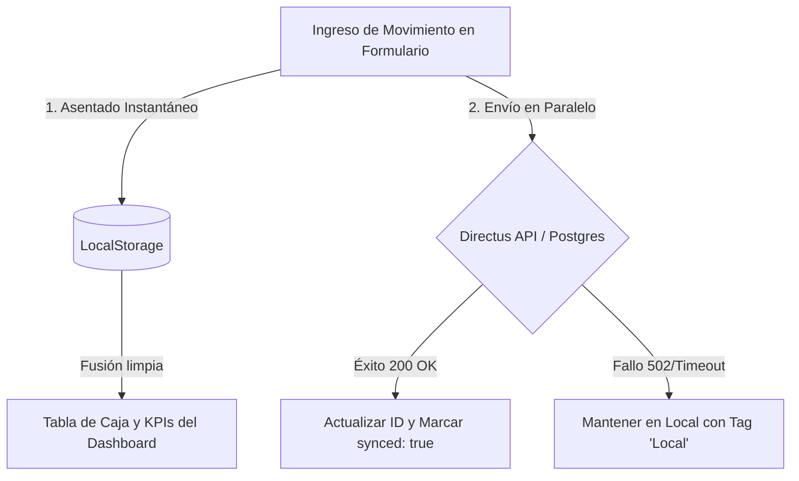

# 💰 Centro Operativo de Caja y Calculadora Proyectada (Dashboard de Fernando)

Este manual técnico y operativo detalla el funcionamiento, la arquitectura de datos y las optimizaciones críticas implementadas en el **Dashboard de Caja** de **Álvarez Placas**, operado por el cajero **Fernando** (`fernando@alvarezplacas.com.ar`).

---

## 1. ⚙️ Arquitectura de Doble Persistencia (Offline First)
Para mitigar la inestabilidad de conexión con el VPS, cortes de red local o lentitud en Directus, la carga diaria de movimientos opera bajo un esquema **Offline First** de alta resiliencia.



### Flujo de Sincronización:
* **Antes del envío por red**: Cada movimiento recibe un identificador temporal (`local_` + timestamp) y se guarda de inmediato en `caja_movimientos_local` en el navegador del cajero.
* **Envío asíncrono**: Se envía a Directus (`https://admin.alvarezplacas.com.ar/items/caja_movimientos`).
  * **Si la API responde exitosamente**: El ID local es reemplazado por el ID incremental de Postgres y se marca la entrada como sincronizada (`synced: true`).
  * **Si la API falla (sin conexión)**: El registro se mantiene visible en la tabla con un badge estilizado de **"Local"** y se re-intenta la subida sin interrumpir el trabajo de Fernando.
* **Fusión Inteligente**: La carga de tablas y KPIs combina ambos flujos (Remoto + Local) eliminando duplicados quirúrgicamente en base a firma única.

---

## 2. 🧮 Calculadora Neta Reactiva y Centralizada
Ubicada en la solapa de **Calculadora Proyectada Avanzada**, esta herramienta sustituye el complejo archivo Excel utilizado originalmente por Fernando, centralizando y automatizando las fórmulas de márgenes comerciales.

### Lógica y Fórmulas Integradas en Alpine.js:

| Componente de Utilidad | Fórmula Excel Integrada | Notas Operativas |
| :--- | :--- | :--- |
| **Margen Base Melaminas V1** | `Venta Sin Corte V1 × 23.077%` | Margen del canal 1 (Blanco) |
| **Margen Servicio Corte V1** | `Corte V1 × 80.0%` | 20% de costo operativo interno en corte |
| **Margen Base Melaminas V2** | `Venta Sin Corte V2 × 23.077%` | Margen del canal 2 (Negro) |
| **Margen Servicio Corte V2** | `Corte V2 × 100.0%` | 100% de utilidad de corte en canal negro |
| **Costo Interno Pegado (V1/V2)** | `Cant. Pegados × Valor Unitario` | Fijo predeterminado a $1,000 unitario |
| **Excedente Servicio Pegado** | `Servicio Total - Costo Interno` | Margen obtenido sobre la tarifa del pegado |
| **Margen de Pegado** | `Costo Interno + (Excedente × 28.5715%)` | Utilidad total por servicio de pegados |

---

## 3. 📅 Control y Guardado de Proyecciones por Períodos

Una de las correcciones críticas aplicadas es la capacidad de **guardar proyecciones y escenarios por período en lugar de por fecha de guardado**, evitando que múltiples simulaciones se colapsen y superpongan en el mismo día calendario.

### 🔄 Selector de Período de Fecha a Fecha:
* Se reemplazó el campo manual de "Días del período" por dos selectores interactivos de tipo fecha (`Desde` y `Hasta`).
* Un getter reactivo de Alpine calcula dinámicamente la duración exacta del rango (`periodoDias`) en base a la diferencia de milisegundos:
  ```javascript
  get periodoDias() {
      if (!this.fechaDesde || !this.fechaHasta) return 30;
      const d1 = new Date(this.fechaDesde);
      const d2 = new Date(this.fechaHasta);
      const diffTime = d2.getTime() - d1.getTime();
      return Math.max(0, Math.ceil(diffTime / (1000 * 60 * 60 * 24)));
  }
  ```

### ⚡ Auto-Sincronización en Vivo de Movimientos Reales:
* Un watcher monitorea los cambios en las fechas `fechaDesde` o `fechaHasta`.
* El motor consulta de forma asíncrona la base de datos y el LocalStorage filtrando por el período seleccionado.
* Suma y precarga en tiempo real:
  - **Gastos Operativos (Fijos + Variables)** en la celda de egresos.
  - **Venta 1 Bruta** y **Venta 2 Bruta** acumuladas.
  - **Impuestos / IVA Ventas**.
* Fernando mantiene el modo *"Sincronización en Vivo"* (Toggle activo) para ver los datos de caja actualizados al instante, o puede desactivarlo en cualquier momento para simular **escenarios libres** sin alterar la contabilidad real.

### 💾 Persistencia de Snapshots Históricos por Período:
Al hacer clic en **"Registrar Cierre Proyectado"**, se asientan las variables en la tabla centralizada `caja_proyecciones` (respaldada en PostgreSQL 16) bajo el siguiente comportamiento óptimo:
* **Fecha de Registro bajo Período**: El registro guarda en el campo `fecha` de la base de datos la fecha de finalización del período simulado (`this.fechaHasta`), en lugar del día calendario actual. Esto permite archivar cierres históricos cronológicos reales.
* **Títulos Dinámicos Sugeridos**: Si la simulación no cuenta con nombre, el prompt sugiere automáticamente un nombre formateado de acuerdo al rango seleccionado:
  ```javascript
  const defaultName = `Cierre Proyectado ${fDesdeStr} a ${fHastaStr}`;
  ```
  *(Ejemplo: "Cierre Proyectado 01/04/2026 a 15/04/2026")*
* **18 Variables de Detalle**: En la columna `detalles_simulacion` (tipo JSON) se asienta el estado integral de la calculadora, garantizando que al presionar el botón **"Cargar"** en la tabla de historial, el sistema restaure de inmediato la configuración exacta de variables y sliders.

---

## 4. 📈 Business Intelligence y Comparativas Visuales
El módulo incorpora dos herramientas de visualización basadas en **ApexCharts**:

1. **Gráfico de Evolución Proyectada (Evolutivo a 3, 6, 12 meses)**:
   - Visualiza de forma acumulativa la trayectoria de **Ventas**, **Gastos** y **Utilidad Neta**.
   - Responde instantáneamente a los deslizadores de simulación (*"Crecimiento Mensual de Ventas"* e *"Inflación Mensual de Egresos"*).

2. **Gráfico Comparativo de Escenarios (Bar Chart)**:
   - Se renderiza al lado del historial.
   - Lee las últimas 5 proyecciones guardadas del período y contrasta sus barras de **Ganancia Neta** lado a lado.
   - Facilita la toma de decisiones del CEO y el Cajero al analizar qué semanas o meses proyectan un mejor margen financiero.

---

## 🔍 Resumen del Estado de Entrega (Build de Producción)
* **Archivo de Componente**: [CalculadoraNeta.astro](file:///d:/Alvarezplacas_2026/WEB-alvarezplacas_astro/Alvarezplacas/web01/Backend/dashboard/components/cajero/CalculadoraNeta.astro)
* **Compilación de Producción**: ✅ Exitosa (`npm run build` en `/web01` completado en 5.40s sin advertencias ni errores).
* **Base de Datos**: Totalmente integrado con Directus API y tablas en PostgreSQL v16.
