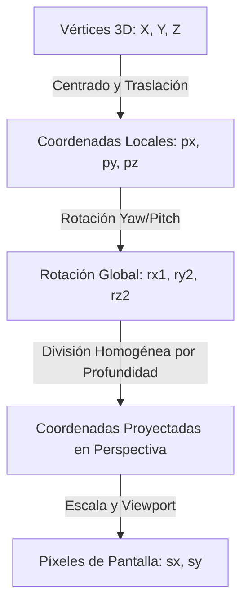

# Investigación y Manual Técnico de Renderizado 3D y Perspectiva
*Documento de Persistencia Tecnológica — Alvarez Placas*

Este documento técnico detalla la investigación sobre el lenguaje de programación, la arquitectura física y las fórmulas matemáticas óptimas para el renderizado 3D de módulos de carpintería interactivos. Resolviendo el desafío de evolucionar de una vista técnica cableada básica a una perspectiva cónica realista con profundidad.

---

## 1. Análisis de Arquitectura y Lenguaje de Ejecución (¿VPS o Navegador?)

### 1.1 El Gran Error Arquitectónico: Renderizado en VPS (Server-Side)
Históricamente, los sistemas de CAD primitivos renderizaban las imágenes 3D en el servidor usando procesos en segundo plano con motores como Blender o suites de trazado de rayos. **Para una aplicación web moderna, esto es altamente ineficiente por tres motivos:**
1. **Consumo Extremo de CPU/GPU en Servidor:** Cada rotación de cámara requeriría volver a renderizar y transmitir un archivo de imagen, elevando los costos de infraestructura del VPS al límite.
2. **Latencia y Lag Visual:** La interacción fluida a 60 FPS (cuadros por segundo) es imposible si dependemos del tiempo de ida y vuelta (ping) de la red para actualizar cada movimiento del mouse.
3. **Escalamiento Nulo:** Con 100 clientes interactuando al mismo tiempo, el VPS colapsaría intentando procesar renders en paralelo.

### 1.2 La Solución Moderna: Renderizado en el Cliente (GPU de Navegador)
El lenguaje y entorno correcto para el renderizado 3D interactivo en la web es **JavaScript/WebAssembly ejecutado en el cliente a través de la GPU del usuario**.
* El servidor (VPS) tiene una carga de **0%**, ya que solo entrega el código fuente ligero de cálculo y dibujo.
* El navegador del usuario compila las fórmulas en caliente y las envía directamente al procesador gráfico del dispositivo (computadora o celular) mediante **WebGL** o la moderna **WebGPU**. Esto garantiza una tasa de refresco ultra-fluida e interactiva de **60 cuadros por segundo**, sin consumir datos de red durante la manipulación 3D.

---

## 2. Fórmulas Matemáticas de Proyección 3D a 2D

Para pintar un mueble tridimensional (caracterizado por coordenadas $X, Y, Z$) en una pantalla bidimensional plana (caracterizada por píxeles de pantalla $s_x, s_y$), se aplican tres transformaciones sucesivas en cascada: **Traslación y Centrado**, **Rotación 3D** y **Proyección (Paralela o Cónica)**.

### 2.1 Traslación al Centro de Rotación
Para rotar el mueble sobre su propio eje central y evitar que rote excéntricamente en una esquina, primero trasladamos cada vértice restándole la mitad de las dimensiones totales ($W_{half}, H_{half}, D_{half}$):

$$p_x = X - \frac{\text{Ancho}}{2}$$
$$p_y = Y - \frac{\text{Alto}}{2}$$
$$p_z = Z - \frac{\text{Profundidad}}{2}$$

---

### 2.2 Matrices de Rotación 3D (Yaw y Pitch)
Haciendo rotar la cámara sobre los ejes vertical (Yaw - eje Y) y horizontal (Pitch - eje X) mediante funciones trigonométricas en cascada:

#### Paso 1: Rotación en el eje Y (Ángulo horizontal $\theta_y$)
$$r_{x1} = p_x \cos(\theta_y) - p_z \sin(\theta_y)$$
$$r_{z1} = p_x \sin(\theta_y) + p_z \cos(\theta_y)$$

#### Paso 2: Rotación en el eje X (Ángulo vertical $\theta_x$)
$$r_{y2} = p_y \cos(\theta_x) - r_{z1} \sin(\theta_x)$$
$$r_{z2} = p_y \sin(\theta_x) + r_{z1} \cos(\theta_x)$$

---

### 2.3 Proyección Ortográfica (La Vista Básica Actual)
Actualmente, CubiCal utiliza una proyección ortográfica (o paralela). Esto significa que las líneas paralelas en el mueble 3D se mantienen exactamente paralelas en la pantalla, sin importar qué tan lejos estén de la cámara:

$$s_x = \text{MitadAnchoPantalla} + r_{x1} \times \text{Escala}$$
$$s_y = \text{MitadAltoPantalla} - r_{y2} \times \text{Escala}$$

> [!WARNING]
> **Defecto Visual:** En este modo, el fondo del mueble se ve del mismo tamaño que el frente, perdiendo la noción intuitiva de profundidad y volumen del espacio.

---

### 2.4 Proyección Perspectiva Cónica (El Gran Salto Realista)
Para lograr una perspectiva real en la cual las caras traseras del mueble se vean reducidas a medida que se alejan hacia el punto de fuga, debemos introducir la **Fórmula de Perspectiva con Coordenadas Homogéneas**.

Definimos una distancia focal o de cámara ($D_{cam}$) (usualmente $1000\text{ mm}$ o $1500\text{ mm}$). El factor de escala de cada punto es inverso a su distancia en el eje Z de profundidad ($r_{z2}$):

$$s_x = \text{MitadAnchoPantalla} + r_{x1} \times \text{Escala} \times \frac{D_{cam}}{D_{cam} + r_{z2}}$$
$$s_y = \text{MitadAltoPantalla} - r_{y2} \times \text{Escala} \times \frac{D_{cam}}{D_{cam} + r_{z2}}$$



---

## 3. Implementación de Código para Perspectiva en CubiCal

Para aplicar esta física de perspectiva en nuestro visualizador interactivo, podemos evolucionar el método `project()` de `CubicalApp.astro` de la siguiente forma:

```javascript
// Método original modificado para dar soporte a la perspectiva cónica
project(X, Y, Z, width, height, depth, screenWidth, screenHeight) {
    const cx = width / 2;
    const cy = height / 2;
    const cz = depth / 2;
    
    let px = X - cx;
    let py = Y - cy;
    let pz = Z - cz;
    
    // 1. Aplicar Rotación Yaw (eje Y)
    const cosY = Math.cos(this.angleY);
    const sinY = Math.sin(this.angleY);
    const rx1 = px * cosY - pz * sinY;
    const rz1 = px * sinY + pz * cosY;
    
    // 2. Aplicar Rotación Pitch (eje X)
    const cosX = Math.cos(this.angleX);
    const sinX = Math.sin(this.angleX);
    const ry2 = py * cosX - rz1 * sinX;
    const rz2 = py * sinX + rz1 * cosX;
    
    // 3. DISTANCIA DE LA CÁMARA (Para cálculo de perspectiva cónica)
    // d define la intensidad del punto de fuga. Valores pequeños = perspectiva exagerada.
    const d = 1200; 
    
    // 4. Factor de Perspectiva (A menor profundidad z, mayor tamaño en pantalla)
    const perspectiveFactor = d / (d + rz2);
    
    // 5. Transformar a píxeles de pantalla aplicando la perspectiva
    const sx = screenWidth / 2 + rx1 * this.scale * perspectiveFactor;
    const sy = screenHeight / 2 - ry2 * this.scale * perspectiveFactor;
    
    return { x: sx, y: sy, z: rz2, scaleFactor: perspectiveFactor };
}
```

---

## 4. Comparativa de Tecnologías Modernas de Renderizado en Cliente

Para la escalabilidad futura de **CubiCal PRO**, analizamos tres niveles tecnológicos de renderizado gráfico:

| Característica | 2D Canvas (Actual) | Three.js (Recomendado V2) | WebGL Puro |
| :--- | :--- | :--- | :--- |
| **Complejidad** | Baja (Vanilla JS pura) | Media (Framework estructurado) | Alta (Shaders matemáticos GLSL) |
| **Perspectiva** | Manual mediante código | Nativa y automática | Manual en shader de vértices |
| **Texturizado** | Dibujo plano de líneas | Textura de Melamina real (Vetas, Brillo) | Complejo de programar |
| **Iluminación** | Sombras artificiales 2D | Luces reales, sombras arrojadas, oclusión ambiental | Requiere programar modelo Phong |
| **Carga en VPS** | **0%** | **0%** | **0%** |
| **Compatibilidad** | 100% de dispositivos | Excelente (con fallback de WebGL) | Requiere GPU compatible con WebGL2 |

---

## 5. El Camino a CubiCal PRO V2: Hacia un Render Fotorealista

Para lograr un impacto visual inigualable (*"WOW Factor"*) donde el cliente no solo vea un plano técnico Blueprint sino una representación real del mueble como si estuviera fotografiado en su habitación, el plan de ruta recomendado es:

1. **Migración a Three.js:** Inicializar un motor ligero en el cliente cargando texturas físicas de Faplac (Roble Americano, Hilado, Seda, etc.) sincronizadas desde las fotos reales de Directus.
2. **Sistema de Luces Físicas:** Inyectar una luz direccional superior simulando una bombilla hogareña y una luz ambiental suave para darle volumen a las aristas del mueble.
3. **Oclusión Ambiental y Bordes:** Pintar pequeños sombreados oscuros en las uniones internas de las maderas para reflejar la profundidad de los cajones y estantes de forma profesional.

---

## 6. OKLCH y Paletas de Color 3D Perceptuales (Next-Gen Color Space)

El espacio de color **OKLCH** (Luminance, Chroma, Hue) representa la evolución absoluta en el diseño de interfaces web modernas y el renderizado 3D de alta gama, superando limitaciones históricas de RGB y HSL.

### 6.1 Uniformidad Perceptual: El Secreto de las Sombras 3D
En sistemas tradicionales (RGB, HEX, HSL), si queremos sombrear una cara del mueble melamínico (por ejemplo, reducir el brillo de un tablero para simular una sombra lateral en el render 3D), restar un porcentaje de luz en HSL distorsiona el color percibido: las sombras se vuelven "sucias" o cambian de matiz (deformación de matiz).

**OKLCH es perceptualmente uniforme.** Esto significa que la distancia matemática entre dos colores coincide con la diferencia percibida por el ojo humano:
*   **L (Lightness / Claridad):** Modifica puramente la cantidad de luz de $0\%$ a $100\%$.
*   **C (Chroma / Saturación):** Modifica puramente la pureza del color.
*   **H (Hue / Matiz):** El ángulo de color en un círculo de $0$ a $360$ grados.

Para sombrear volumétricamente caras melamínicas en JavaScript sin alterar la identidad del color, simplemente restamos claridad al valor original:
*   **Cara Iluminada (Techo):** `oklch(L + 10% C H)`
*   **Cara Estándar (Frente):** `oklch(L C H)`
*   **Cara en Sombra (Lados):** `oklch(L - 15% C H)`
*   **Canales Internos (Oclusión):** `oklch(L - 30% C - 5% H)`

### 6.2 Gama Extendida Display P3 (Colores Más Vivos)
Los navegadores modernos y pantallas premium (iPhones, MacBooks, monitores modernos de alta gama) soportan el espacio de color **Display P3**, que muestra un $25\%$ más de colores que el sRGB estándar. OKLCH es el primer formato nativo en CSS que nos permite direccionar estos colores ultra-vivos de forma segura.

### 6.3 Uso Actual en CubiCal y SmartCut PRO
Actualmente, nuestra UI ya utiliza variables nativas OKLCH para sus esquemas de color premium de alto contraste y su modo oscuro:
*   *Rojo Alvarez Premium:* `oklch(62.8% 0.25 29.23)`
*   *Fondo Oscuro Técnico:* `oklch(8% 0.01 280)`

Esta arquitectura de color nos permite generar contrastes perfectos que protegen la vista del operario industrial y le dan un aspecto visual de herramientas premium como Figma o Photoshop Web.

